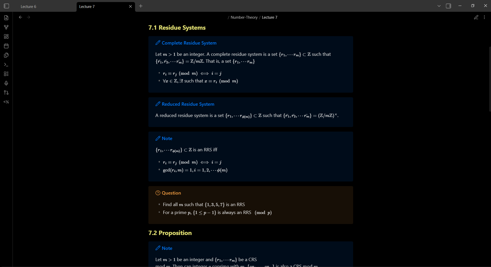

## **Here are 1st semester notes for B-Math Course in the following courses: Real Analysis, Number Theory, Fundamentals of Computing and Programming. I've written them in [obsidian](https://obsidian.md/).**

Here is how to set it up in your system
1. Install a version of Obsidian for your system from https://obsidian.md/
2. [Clone this repo in your system.](https://docs.github.com/en/repositories/creating-and-managing-repositories/cloning-a-repository)
3. Open obsidian and make sure you have all the community plugins from [here](https://github.com/adi42wastaken/notes-sem-1/tree/main/.obsidian/plugins)
4. It should work now and look something like this:

5. (Optional) You can fork this repo and make your own notes.

There's a good chance I might've made mistakes while writing the notes, in that case you can email me: adityateraiyaself@gmail.com
